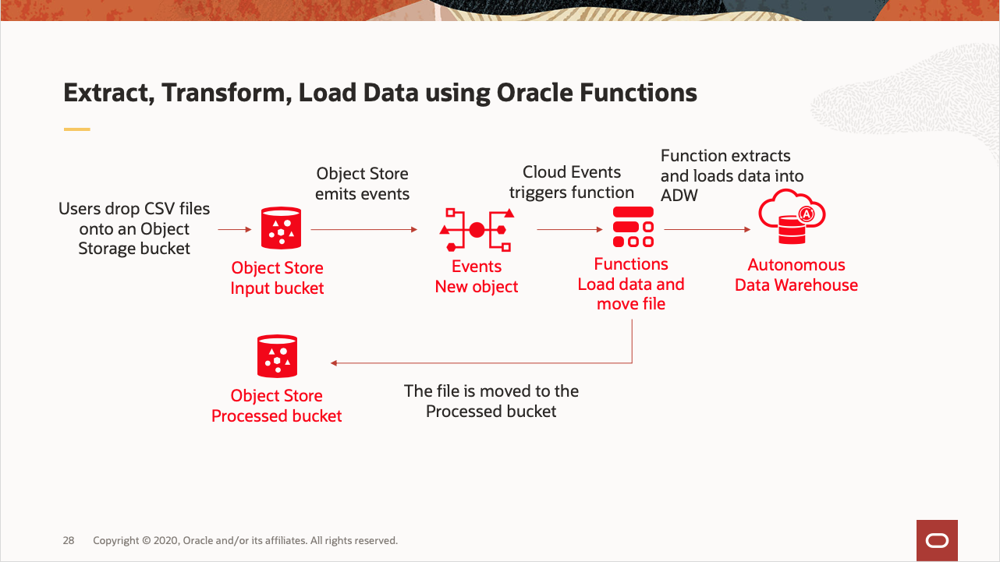
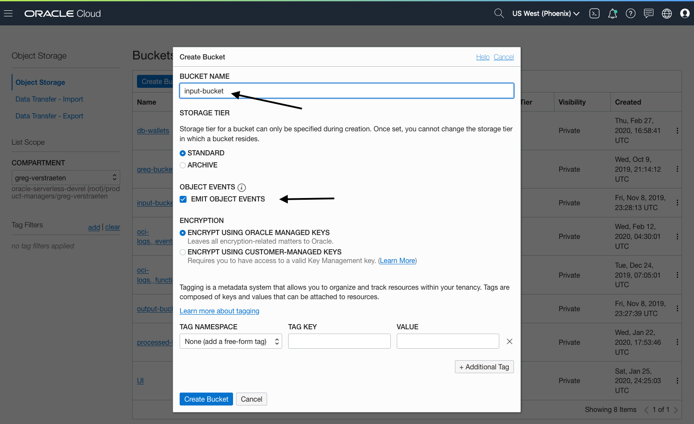
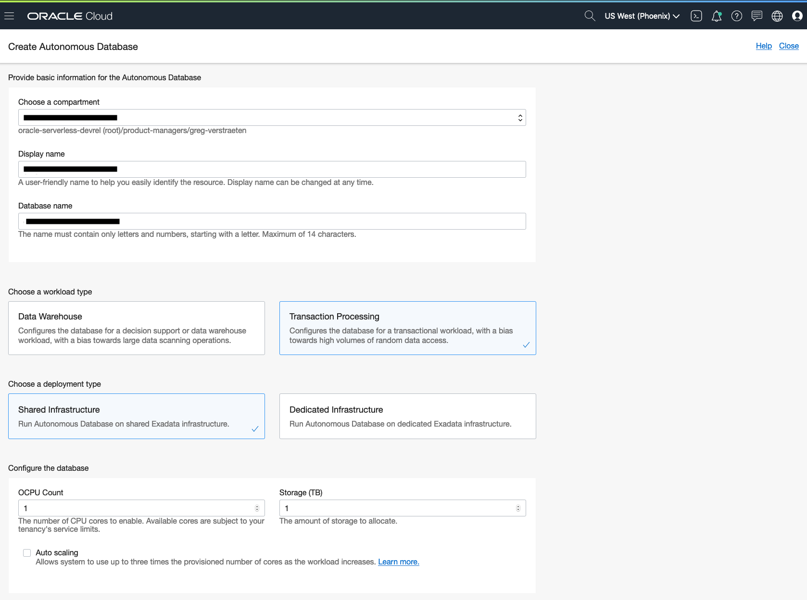
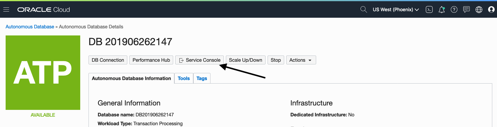
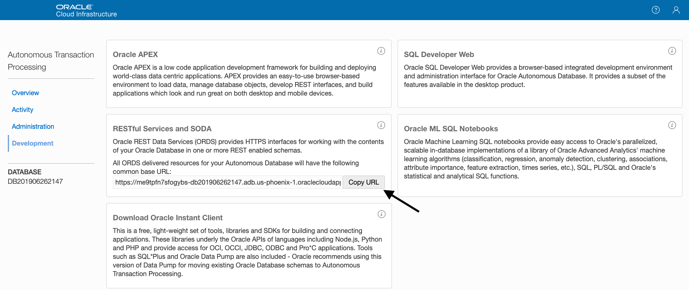
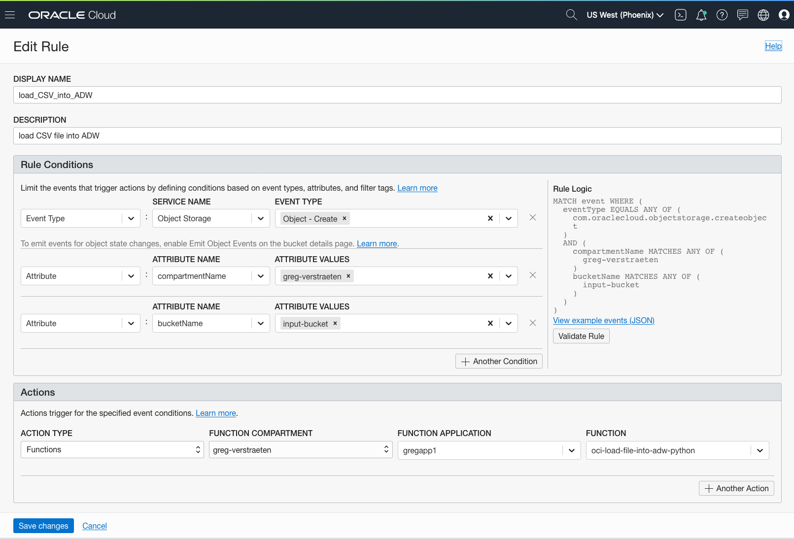

# Automatically load data from Object Storage into Autonomous Database
We often have to extract data from various databases or applications and load it into a Data Warehouse to get analysed. 
You can automate this process on OCI using Cloud Storage, Cloud Events, Functions and Autonomous Data Warehouse.



## Prerequisites
Before you deploy this sample function, make sure you have run step A, B and C of the [Oracle Functions Quick Start Guide for Cloud Shell](https://www.oracle.com/webfolder/technetwork/tutorials/infographics/oci_functions_cloudshell_quickview/functions_quickview_top/functions_quickview/index.html)
* A - Set up your tenancy
* B - Create application
* C - Set up your Cloud Shell dev environment


## List Applications 
Assuming your have successfully completed the prerequisites, you should see your 
application in the list of applications.

```
fn ls apps
```

## Create or Update your Dynamic Group
In order to use other OCI Services, your function must be part of a dynamic group. 

When specifying the *Matching Rules*, we suggest matching all functions in a compartment with:
```
ALL {resource.type = 'fnfunc', resource.compartment.id = 'ocid1.compartment.oc1..aaaaaxxxxx'}
```

## Create Object Storage buckets
You need two buckets in Object Storage. The first bucket is the location where you will drop the CSV files to be imported into Autonomous Database. The files will be moved to the second bucket once they are processed. 


Create the two buckets, for example "input-bucket" and "processed-bucket". Check the *Emit Object Events* box for the first bucket (for input).




## Create or Update IAM Policies
Create a new policy that allows the dynamic group to manage objects in your two buckets.


Your policy should look something like this:
```
Allow dynamic-group SystemDynamicGroup to inspect instances in compartment <compartment-name> 
Allow dynamic-group <dynamic-group-name> to manage objects in compartment <compartment-name> where target.bucket.name=<input-bucket-name>
Allow dynamic-group <dynamic-group-name> to manage objects in compartment <compartment-name> where target.bucket.name=<processed-bucket-name>
allow dynamic-group SystemDynamicGroup to read secret-family in compartment <compartment-name>
allow service objectstorage-<region-name> to manage object-family in compartment <compartment-name>
```
For more information on how to create policies, check the [documentation](https://docs.cloud.oracle.com/iaas/Content/Identity/Concepts/policysyntax.htm).


## Create an Autonomous Database
The function accesses Autonomous Database using SODA (Simple Oracle Document Access) for simplicity. 

Use an existing Autonomous Database or create a new one.


On the OCI console, navigate to *Autonomous Data Warehouse* and click *Create Autonomous Database*. In the Create Autonomous Database dialog, enter the following:
- Display Name
- Compartment
- Database Name
- Infrastructure Type: Shared
- Admin password
- License type



On the Autonomous Database detail page, click *Service Console*


On the Service Console, navigate to Development and copy the ORDS Base URL, we will need it in the next sections.


The *admin* schema is enabled for REST access by default, so you can test the function using the *admin* schema. For Production, it is recommended to create a separate schema and enable REST Service. For more information on how to do this, check the documentation at https://docs.oracle.com/en/database/oracle/oracle-rest-data-services/19.1/index.html.


From your terminal, create the collection 'regionsnumbers':
```bash
curl -X PUT -u 'ADMIN:<DB password>' -H "Content-Type: application/json" "<ADW-ORDS-URL>/admin/soda/latest/regionsnumbers"
```

## Create a Vault with a key and secret

*    Login to the OCI Console as an Administrator
*    Go to Menu > Security > Vault
*    Select the compartment 
*    Click the Create Vault button
*    Enter the following:
**        Name:  my-vault
*    Click Create Vault button to save
*    Click on the my-vault that was just created
*    Click on the Keys link under Resources 
*    Click Create Key button
**    Enter a Name for the key; e.g. my-vault-key
**    Select 256 bits from the Key Shape
*    Click Create Key button to save
*    Click on the Secrets link under Resources
*    Click Create Secret button
*    Enter the following:
**        Name:  my-secret
**        Description:  My Secret
**        Encryption Key:  select my-vault-key created earlier
**        Secret Contents:  <(DB) Admin User Password>
*    Click Create Secret button
*    Click on the secret “my-secret”
*    Copy the secret OCID to be used next.


## Review and customize the function
Review the following files in the current folder:
* the code of the function, [func.py](./func.py)
* its dependencies, [requirements.txt](./requirements.txt)
* the function metadata, [func.yaml](./func.yaml)


## Deploy the function
In Cloud Shell, run the *fn deploy* command to build the function, 
push the image to OCIR, and deploy the function to Oracle Functions in your application.


```
fn -v deploy --app <app-name>
```


## Set the function configuration values
The function requires several configuration variables to be set.


Use the *fn CLI* to set the config value:
```
fn config function <app-name> <function-name> ords-base-url <ORDS Base URL>
fn config function <app-name> <function-name> db-schema <DB schema>
fn config function <app-name> <function-name> db-user <DB user name>
fn config function <app-name> <function-name> password_id <password secret(my-secret) OCID>
fn config function <app-name> <function-name> input-bucket <input bucket name>
fn config function <app-name> <function-name> processed-bucket <processed bucket name>
```
e.g.
```
fn config function myapp oci-adb-ords-runsql-python ords-base-url "https://xxxxxx-db123456.adb.us-region.oraclecloudapps.com/ords/"
fn config function myapp oci-adb-ords-runsql-python db-schema "admin"
fn config function myapp oci-adb-ords-runsql-python db-user "admin"
fn config function myapp oci-adb-ords-runsql-python password_id "ocid1.vaultsecret.oc1.iad.amaaaaaa"
fn config function myapp oci-adb-ords-runsql-python input-bucket "input-bucket"
fn config function myapp oci-adb-ords-runsql-python processed-bucket "processed-bucket"
```


## Create an Event rule
Let's configure a Cloud Event to trigger the function when files are dropped into your *input* bucket.


Go to the OCI console > Application Integration > Events Service. Click *Create Rule*.


Assign a display name and a description.
In the *Rule Conditions* section,create 3 conditions:
* type = *Event Type*, Service Name = *Object Storage*, Event Type = *Object - Create*
* type = *Attribute*, Attribute Name = *compartmentName*, Attribute Value = *your compartment name*
* type = *Attribute*, Attribute Name = *bucketName*, Attribute Value = *your input bucket*
In the *Actions* section, set the *Action type* as "Functions", select your *Function Compartment*, your *Function Application*, and your *Function ID*.




## Test
Finally, let's test the workflow.


Upload one CSV files from the current folder to your *input bucket*. 

On the OCI console, navigate to *Autonomous Data Warehouse* and click on your database, click on *Service Console*, navigate to Development, and click on *SQL Developer Web*. Authenticate with your ADMIN username and password.
Enter the following query in the *worksheet* of *SQL Developer Web*:
```sql
select 
 id,
 r.json_document.region,
 r.json_document.col1,
 r.json_document.col2,
 r.json_document.col3,
from regionsnumbers r
```
You should see the data from the CSV files.
